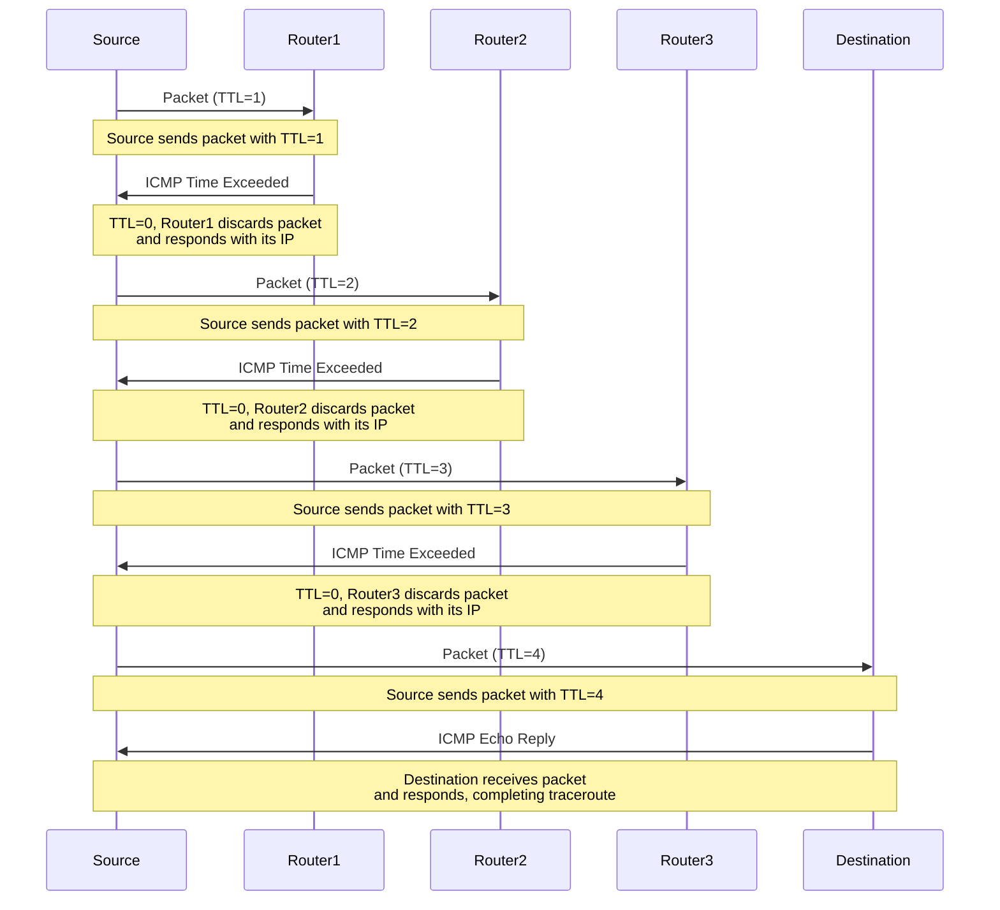

É um utilitário usado para identificar o caminho que um pacote trafega na rede até seu destino final.

```shell
$ traceroute -n google.com
# -n: não mapeia o hostname do IP, deixando a saída mais limpa
```

O comando acima exibe todos os `hops` (roteadores, switches etc) que o pacote percorre até chegar nos servidores da google.


> [!info] Protocolo do Pacote
> Por padrão, o `traceroute` envia pacotes sob o protocolo [[5. UDP|UDP]] com porta de destino iniciando em `33434` e sendo gradualmente incrementada.


Basicamente a forma como o `traceroute` funciona é enviar `n` pacotes com um `ttl` (ver [[5. IP (Protocol)#TTL| IP - TTL]]) equivalente ao "índice" do pacote. Ou seja, o primeiro pacote é enviado com um `ttl = 1` e ao chegar ao primeiro `hop` seu valor é decrementando; se após o decremento o valor for `=0`, então o pacote chegou no seu limite de vida e é retornado para a origem. Se o `ttl > 0`, então há mais `hops` a serem percorridos, dessa forma o `hop n` encaminha o pacote para o `hop n+1`.

> [!note] Parâmetros interessantes
> `-m <number>`: TTL máximo
> `-w <seconds>`: timeout em segundos
> `-A`: exibe o nome dos [[5. Autonomous System]] de cada rota
> `-p <port>`: altera a porta de destino
> `-U`: protocolo [[5. UDP|UDP]] na porta `53` ([[5. DNS (Protocol)|DNS]])
> `-T`: pacote com protocolo [[5. TCP|TCP]]
> `-I`: pacote com protocolo [[5. ICMP|ICMP]]

# Timeouts e pacote rejeitado

Para cada `ttl` são enviados três pacotes com objetivo de ter melhor precisão de tempo de resposta e minimizar perdas de pacotes que podem acontecer por conta de timeouts, congestionamentos de rede etc. Além disso, cada pacote do `ttl` pode passar por rotas diferentes; indício de **loadbalancing**. Um pacote perdido é identificado por um `*` exibido no terminal. Para rotas muito distantes, é uma boa prática aumentar o **timeout** com o parâmetro `-w <seconds>`.

Contudo, é possível que todos os três pacotes sejam perdidos mesmo aumentando o **timeout**, indicado pelo retorno `* * *`. Isso pode acontecer se o **host** bloquear protocolo **UDP** ou uma porta específica, por exemplo. É possível alterar tanto a porta com a opção `-p`, quanto mudar o tipo de pacote com `-T` para [[5. TCP|TCP]] ou `-I` para [[5. ICMP|ICMP]].

# Diagrama


