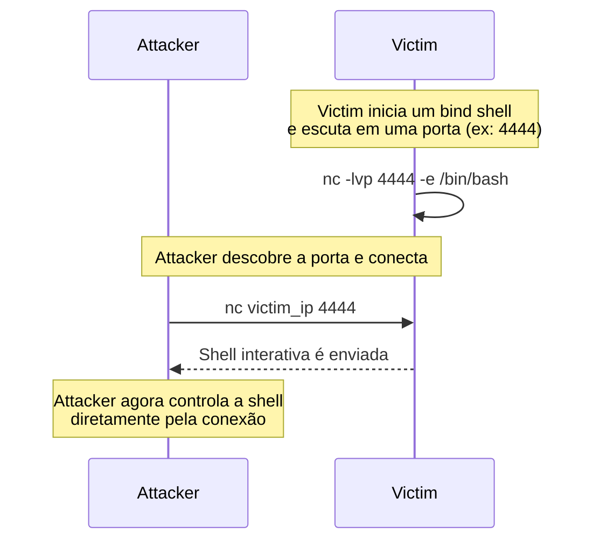

**Bind shell** é um conceito importante que consiste em estabelecer uma conexão direta com um [[5. Host]] alvo, permitindo a execução remota de comandos. Neste cenário, o host alvo precisa escutar em algum socket que, ao receber conexão, "envia" seu [[7. Shell]] para o atacante. 

> [!NOTE] Envio do shell
> A forma como se dá esse "envio" do shell é fazendo com que os dados recebidos pelo host alvo sejam redirecionados para a entrada padrão de um binário de shell ao mesmo tempo que sua saída seja enviada para o atacante 

# Possíveis problemas

Para um bind shell funcionar o host alvo precisa escutar por requisições numa porta aberta e o atacante precisa se conectar nessa porta. Contudo, é possível que mecanismos de [[5. Firewall]] interceptem e descartem os pacotes [[5. TCP]] enviados pelo atacante.

Mesmo que no firewall do host alvo a porta esteja liberada, é possível que ainda assim um firewall de rede faça a intercepção.

> [!blueteam] Configure bem o Firewall
> Bloquear, por padrão, todas as portas de entrada e liberar apenas as necessárias é uma boa prática para evitar que um host esteja suscetível a **bind shell**. Além disso, é bom também limitar as portas de saída pelas quais o host pode ser conectar com a internet.
> 
> Para mais detalhes de regras de firewall, veja [[1. iptables]].

# Alternativas

Como alternativa, existe o [[5. Reverse Shell]] que inverte o responsável pela inicialização da conexão. Neste caso, o host alvo inicia a conexão com o atacante, e não o contrário.

> [!redteam] Reverse Shell
>  O reverse shell é altamente eficaz em ambientes restritos. Ele aproveita o fato de que hosts geralmente têm permissão para iniciar conexões de saída, mesmo quando conexões de entrada estão bloqueadas por Firewall. Essa característica é comum em redes corporativas e pode ser explorada para obter acesso remoto.

# Exemplo

Exemplos podem ser encontrado em:
- [[1. ncat#Bind Shell|1. ncat - Bind Shell]].