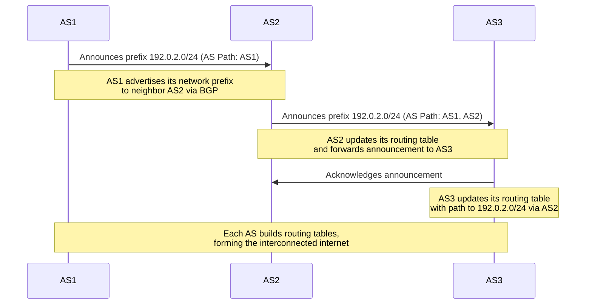

**Border Gateway Protocol (BGP)** é um protocolo utilizado em comunicações entre **[[5. Autonomous System]]** para que estes divulguem seus prefixos de rede para a internet global. Esse anúncio possibilita que um **AS** informe outros **AS**es que determinados [[5. Net Blocks]](prefixos) devem ser roteados para ele.

Através desses anúncios cada **AS** constrói uma tabela de roteamento que contém o caminho adequado para alcançar cada bloco de rede. Isso possibilita a criação de uma rede global formada por diversos **AS**es interconectados. Como um **AS** é, essencialmente, um conjunto de redes, temos então uma estrutura de redes independentes interligadas formando a internet.

# Monitoramento de BGP

#osint

Existem alguns sites que fazem monitoramento em tempo real de anúncios de **AS**es realizados com o protocolo **BGP**. Esses sites basicamente catalogam todos os blocos de rede pertencentes a um **AS**. Isso é extremamente útil para fazer **osint** de infraestrutura, ou seja, descobrir blocos de IP de uma empresa, sub domínios etc.

Alguns sites:
- https://bgp.he.net (consulta **PTR Records**)
- https://stat.ripe.net
- https://bgpview.io
- https://www.peeringdb.com/

> [!info] Confiabilidade
> Catálogos de anúncios BGP são mais confiáveis do que, por exemplo, o [[1. whois]]. Isso acontece, pois esses catálogos monitoram em tempo real os anúncios, enquanto o `whois` retorna apenas as informações que foram registradas formalmente.

> [!info] PTR Records
> O site `bgp.he.net` faz consulta de registros **PTR** ([[6. Resolução Reversa de DNS]]), conseguindo mapear `IP -> subdomínio`. Isso pode ser encontrado na aba **Prefixes v4** ou **Prefixes v6**, escolher algum prefixo de rede e depois ir na aba **DNS**.
