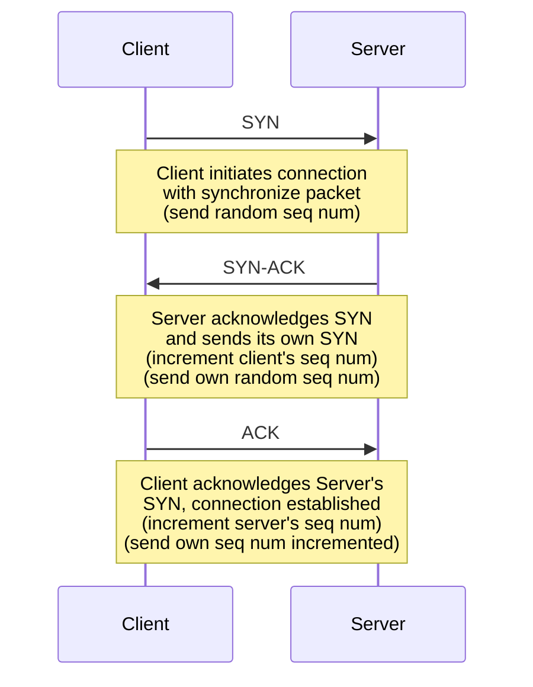
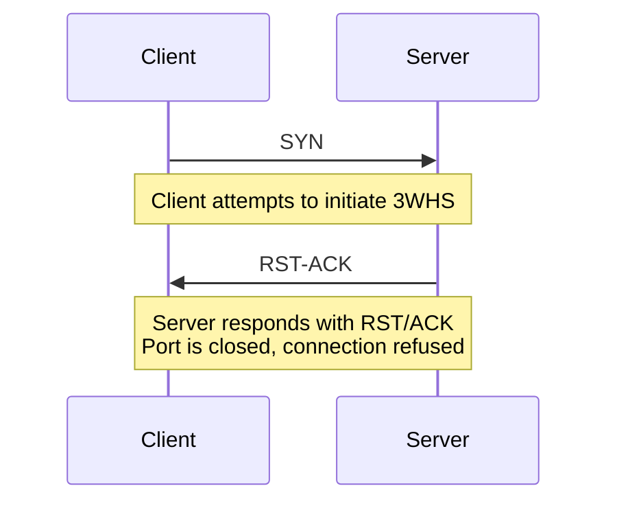

O **Transmission Control Protocol** (TCP) é um protocolo orientado à conexão, portanto trocas de pacotes entres hosts só podem ser feitas a partir do momento em que uma conexão for realizada entre ambos.

Estrutura de um cabeçalho TCP:

| Campo                     | Tamanho    | Função                                                                                                                      |
| ------------------------- | ---------- | --------------------------------------------------------------------------------------------------------------------------- |
| **Source Port**           | 16 bits    | Porta TCP do remetente.                                                                                                     |
| **Destination Port**      | 16 bits    | Porta do destinatário.                                                                                                      |
| **Sequence Number**       | 32 bits    | Byte‑offset do primeiro dado deste segmento.                                                                                |
| **Acknowledgment Number** | 32 bits    | Próximo byte que o host espera receber.                                                                                     |
| **Data Offset**           | 4 bits     | Quantas palavras (x4 bytes) o cabeçalho possui (mín.: 5 = 20 bytes).                                                        |
| **Reservado**             | 3 bits     | Deve ficar em 0; reservado para uso futuro.                                                                                 |
| **Flags (Controle)**      | 9 bits     | NS, CWR, ECE, URG, ACK, PSH, RST, SYN, FIN.                                                                                 |
| **Window Size**           | 16 bits    | Janela de recepção (controle de fluxo).                                                                                     |
| **Checksum**              | 16 bits    | Verifica integridade ([[#Cálculo de checksum]])                                                                             |
| **Urgent Pointer**        | 16 bits    | Offset do último byte “urgente” quando **URG=1**.                                                                           |
| **Options**               | 0–40 bytes | MSS, SACK Permitted, Timestamps, Window Scale, etc.                                                                         |
| **Padding**               | variável   | Zeros para alinhar opções a múltiplo de 32 bits. Por exemplo, se `Options` possuir 30bytes, então o padding será de 2 bytes |

# Three Way Handshake

O nome que se dá ao estabelecimento da conexão é **three way handshake** (3WHS). Ele é constituído pela troca de três pacotes entre cliente e servidor:

1. O cliente envia um pacote contendo a flag `SYN` ativa, indicando que deseja se conectar ao servidor. Junto com este pacote é enviado o `sequence number` inicial que representa um `offset`. O valor inicial é arbitrário e será útil para o servidor identificar a ordem e integridade dos próximos pacotes.
2. O servidor, aceitando a conexão, responde com outro pacote contendo as flags `SYN` e `ACK`. No `ACK` o servidor indica que reconhece o `sequence number` enviado pelo cliente, retornando em `acknowledgement number` seu valor incrementado em `1`. Dessa forma, o servidor indica que o próximo `sequence number` que o cliente enviar deve ser nesse offset incrementado. O servidor também retorna seu próprio `sequence number` inicial para o cliente.
3. O cliente recebe a resposta do servidor e devolve com um `ACK`, também reconhecendo o `sequence number` do servidor, enviando ele em `acknowledgement number` incrementado em `1`. Lembrando que neste pacote, o cliente envia seu próprio `sequence number` incrementado em `1`, como solicitado pelo servidor anteriormente.

Para mais detalhes sobre os incrementos do `sequence number`, veja a seção [[#Como e por quê os sequence numbers são incrementados]].



Note que todo pacote que contém a flag `ACK` incrementa o `acknowledgement number`, fazendo com que o host que recebe o pacote tenha que, também, incrementar o `sequence number` de seu próximo pacote.

Após essa três trocas de pacotes `TCP`, tanto cliente quanto servidor aceitaram a conexão e estão sincronizados pelos seus `sequence numbers`. Após a conexão ser estabelecida, demais pacotes podem ser trocados livremente, transferindo `payloads`. Quando isso acontece, a flag `PSH` do pacote estará ativada.

Dessa forma, o próximo `sequence number` do cliente é sempre salvo no `acknowledgement number` do servidor, e o próximo `sequence number` do servidor é sempre salvo no `acknowledgement number` do cliente. Se o servidor envia um pacote incrementando seu `acknowledgement number`, isso tem que ser refletido no `sequence number`  do cliente no próximo pacote enviado por este, e vice-versa, ou seja, se o cliente envia um pacote incrementando o `acknowledgement number` isso tem que refletir no `sequence number` do próximo pacote enviado pelo servidor.


# Como e por quê os sequence numbers são incrementados?

O `sequence number`, por se tratar de um `offset`, indica a posição(índice) em que uma sequência de bytes se inicia. Portanto, se um cliente inicia seu `offset` na posição `1000` isso significa que seu próximo pacote **A** será enviado com `sequence number = 1000`. Da mesma forma, o servidor espera receber o próximo pacote do cliente na posição `1000`, pois é o valor salvo em seu `acknowledgement number`.

> [!info] Sequence Number Inicial
> O valor do `sequence number` **inicial**, enviado pelo cliente no primeiro pacote, é um número de 32bits arbitrário, podendo ter qualquer valor. Seu objetivo é de apenas servir como base para que os incrementos possam acontecer.

Digamos que o pacote **A** tenha `300B` de payload, isso significa que ele vai da posição `1000` até `1299` (totalizando 300 posições). O servidor, reconhecendo isso  ao comparar seu `acknowledgement number` com o `sequence number` recebido, lê os `300B` e **incrementa** seu `acknowledgement number` em `300B` e o devolve num pacote para o cliente.

O próximo pacote **B** do cliente **deve** iniciar na posição `1300` (`offset inicial` + `300B de A`) e o envia, contendo por exemplo `250B` de payload. O servidor então faz o mesmo processo: compara o `sequence number` do pacote **B** com o `acknowledgement number` esperado e incrementa o `acknowledgement number` em `250B`, devolvendo-o num pacote de resposta para o cliente.

Para finalizar, o próximo pacote **C** enviado pelo cliente **deve** conter `sequence number = 1550`, que é `offset inicial(1000) + 300B de A + 250 de B`, pois é este valor que o servidor retornou no `acknowledgement number` do pacote anterior.

> [!note]
> O cliente também incrementa seu `acknowledgement number` assim como o servidor também incrementa seu `sequence number`. Ambos hosts conectados devem sincronizar seus `sequence numbers` sempre que recebem um pacote do outro.
> 

Essa sincronização de `sequence number` e `acknowledgemnet number` garante que os dados sejam recebidos de forma confiável, pois eles sempre são verificados pelo cliente e servidor para validar a ordem dos pacotes:

```
Pacotes recebidos:   [    A    ][   B   ][      C      ]
```

Se por algum acaso chegar um pacote **D** com um `sequence number` que conflite com outros pacotes, esse problema será identificado:

```
                           [   D   ]
Pacotes recebidos:   [    A    ][   B   ][      C      ]
```

Neste exemplo, o pacote **D** inicia "dentro" do pacote **A** e termina "dentro" do pacote **B**, claramente é um conflito por não estar seguindo a sequência correta.

# Cálculo de checksum

#todo

# Encerrando a conexão

Quando todos os pacotes foram enviados e o cliente deseja encerrar a conexão, acontece um processo parecido com o **3WHS**. O cliente envia um pacote com as flags `ACK/FIN`, incrementando o `acknowledgement number` em `1`. O servidor responde com um `ACK/FIN`, também incrementando o `acknowledgement number` em `1`. Por fim, o cliente responde apenas com um `ACK`.

Mesmo nesse processo de encerramento de conexão os `sequence numbers` são verificados. Se alguma coisa estiver errada, a conexão pode se manter.

## Quando a conexão falha

Numa tentativa de estabelecer **3WHS**, o servidor pode retornar um pacote com `RST/ACK`. A flag `RST` indica que algum problema ocorreu, por exemplo, caso a porta em que o cliente tente se conectar esteja fechada.

