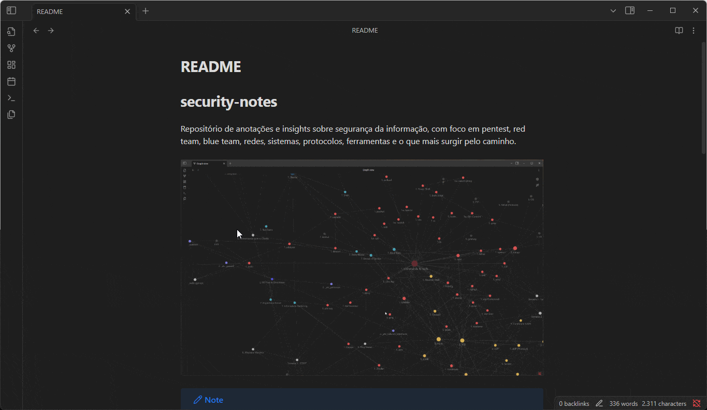

# security-notes

Repositório de anotações e insights sobre segurança da informação, com foco em pentest, red team, blue team, redes, sistemas, protocolos, ferramentas e o que mais surgir pelo caminho.



> [!NOTE]
> Todo o conteúdo deste repositório foi feito utilizando o [Obsidian](https://obsidian.md/), portanto é recomendado que utilize ele, ou algum software parecido, para a navegação entre as notas.
>
> Para quem for abrir no Obsidian, recomendo que veja o arquivo `misc/Obsidian - Custom CSS.md`

Este repositório começou como um projeto pessoal, para fixação do conteúdo apresentado pelo curso da [DESEC](https://desecsecurity.com/) e de outras fontes. É possível, e muito provável, que algumas explicações contidas aqui estejam imprecisas e incompletas.

## Estrutura

```
security-notes/
├── 1. Index/
├── 2. Notes/
│   ├── 1. Knowledge/
│   ├── 2. Applications/
│   └── 3. References/
├── 3. Templates/
```

_Os prefixos numerados nas notas e diretórios são meramente para manter uma ordem específica, se não os arquivos são organizados alfabeticamente._

-   `Index`: contém os arquivos de índice; relaciona as notas e facilita a busca/visualização via `graph`
-   `Notes`: aqui é onde estão todas as notas
    -   `Knowledge`: explicações conceituais sobre redes, termos comuns, uso de ferramentas etc.
    -   `Applications`: notas que reúnem e aplicam, de forma prática e integrada, o que foi aprendido em `Knowledge`. Por exemplo, a nota `6. Enumerar Subdomínios` integra todos os métodos e ferramentas sobre o assunto apresentado nas notas `Knowledge`.
    -   `References`: referências a documentos, cheat sheets, livros etc.
-   `Templates`: arquivos de template, usados para a criação de notas de um determinado `Index`. Notas criadas a partir de templates devem ser inclusas em `Knowledge` ou `Applications`.

## Contribuição

Este repositório está aberto a contribuições. Se quiser sugerir uma nova estrutura de organização, criar, atualizar ou remover notas, basta clonar o repositório, criar uma branch baseada na `master` e abrir uma issue explicando o que pretende fazer 🤠👍.
