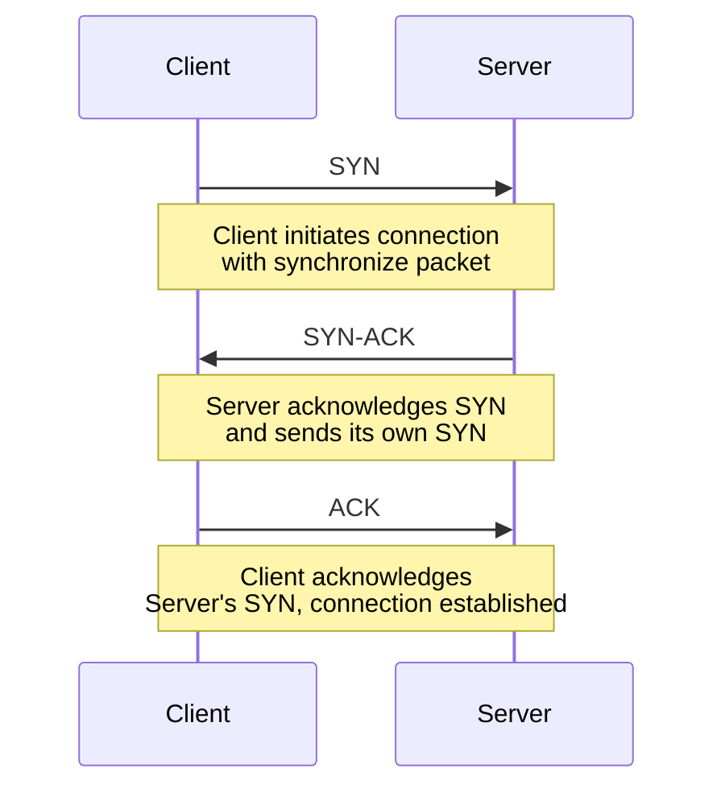

Os exemplo de arquivos `css` neste documento podem ser criados na pasta `<vault-name>/.obsidian/snippets` e ativadas nas configurações (`Appearance -> CSS Snippets`).

---

```css
/** blueteam-callot.css */
.callout[data-callout="blueteam"] {
    --callout-color: 0, 90, 250;
    --callout-icon: lucide-shield-plus;
}
```

> [!blueteam] Blue Team
> Deve ter o icon de um escudo com um sinal de mais e fundo azul

---

```css
/** redteam-callot.css */
.callout[data-callout="redteam"] {
    --callout-color: 0, 90, 250;
    --callout-icon: lucide-shield;
}

```

> [!redteam] Red Team
> Deve ter o icon de duas espadas cruzadas e fundo vermelho


---

```css
/** mermaid.css */

.mermaid svg {
    display: block;
    width: 100%;
    height: auto;
    max-height: 650px; 
    margin: 0;
    padding: 0;
}


```

Diagrama deve estar centralizado:

